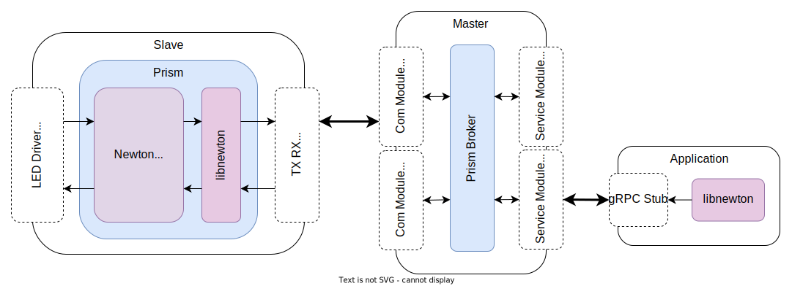

# 🌈 Prism

Prism is a protocol for manipulating LED strips at runtime with a predefined set of instructions in a _Master - Slave_
model

Prism is meant to be extensible in order to allow multiple independent programs to communicate with LED strips

## 🧑‍🏭 Roles

### Master

### Slave

A Prism slave is a device attached to a LED strip and interprets commands sent by a [master](#master) in order to
trigger changes in color. Slaves will always have a [Newton Interpreter](#newton) which contains the
inner [registers](#registers) and interprets commands in a _Prism Binary Format_

- Slaves can communicate via different unique protocols as long as the [master](#master) supports
  them. [(List of standard communication protocols)](#standard-communication-protocols)

## ✍ Prism Scripting Language

### ⚙️ Assembler

## Components
### 📜 Buffer

The buffer is the main data structure inside the [Prism Slave](#slave), it is an array of HSL values whose size is the
same as the attached LED strip (upto a maximum of 256 due to the limitations of 8-bit registers), each position of the
array is 3 bytes long (one byte for each of the HSL components).

### 📋️ Instruction Set
Prism provides a basic set of instructions for manipulating the [buffer](#buffer) and the [slave's](#slave) behaviour.

Instructions are sent from [master](#master) to [slave](#slave) in a variable size frame, the first 6-bits
correspond to the instruction, next 2-bits correspond to the addressing options and the subsequent bytes will depend on
the instruction.

## 🔭 Newton

Newton is the name given to the _Prism instruction interpreter_ therefore a _Newton Interpreter_ is required in
every [slave](#slave) device. In order to interact with the _Newton Interpreter_ the **[libnewton
](https://github.com/taleroangel/libnewton)** library must be used, visit the repository for more information.

## 📡 Standard Communication Protocols

### 🔵 Bluetooth (BLE)

#### GATT Description

- Prism Service UUID: `a7a37338-0c20-4779-b75a-089c6d7a0ac8`
- Newton Characteristic
    - __UUID:__ `4e639365-9e62-4d81-8e3d-f0d2bde4ccc6`
    - __Type:__ READ and WRITE
    - __Unit:__ 0x2700 - unitless
    - __Format:__ 0x06 - uint16 (Big Endian)

